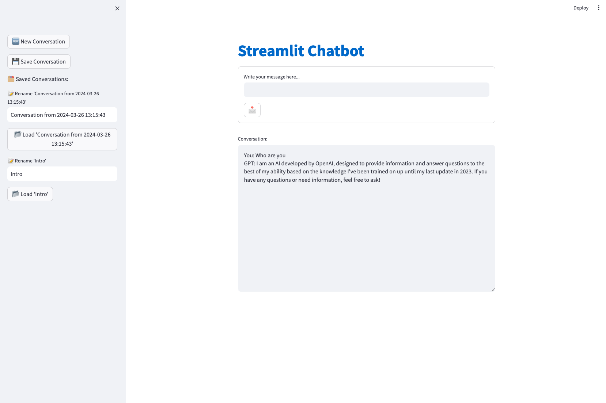
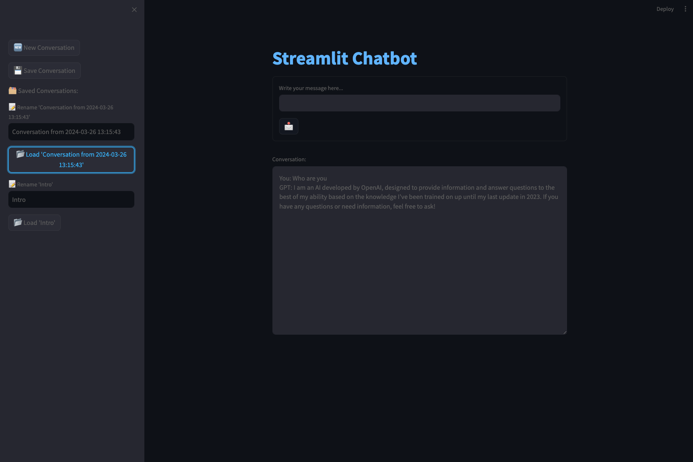
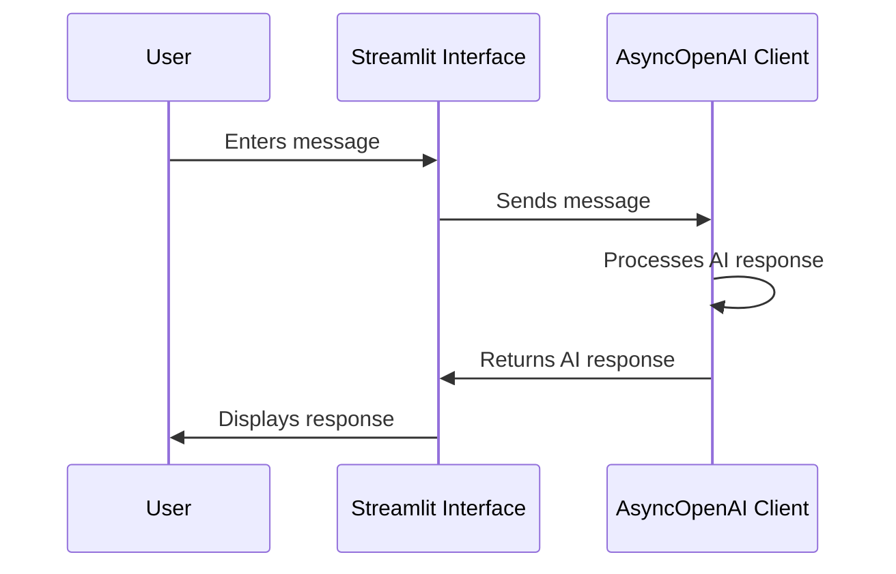

# Streamlit Chatbot with OpenAI

This project integrates OpenAI's language models into a Streamlit web application, creating an interactive chatbot interface. It allows users to send messages and receive AI-generated responses, manage conversation history, and perform other interactions in real time.

## Features

- **Interactive Chat Interface**: Engage in a conversation with the AI, with the ability to view each message's response in real time.
- **Conversation History**: Maintains a log of the entire conversation for reference.
- **Conversation Management**: Supports starting new conversations, saving current conversations, renaming them, and switching between them.

## Tech Specs

- **Conda**: Python 3.10
- **Streamlit**: 1.32.2
- **OpenAI**: 1.14.3
- **ChatGPT**: gpt-4-turbo-preview

## Code Breakdown

### OpenAI Integration

- `AsyncOpenAI Client`: Utilises `openai.AsyncOpenAI` for creating an asynchronous client with the OpenAI API, authorised via an environment-stored API key.
- `get_response`: An asynchronous function that sends user messages to the OpenAI API and awaits responses, utilizing the "gpt-4-turbo-preview" model.

### Streamlit Interface

- **Initialization**: Checks and initialises `session_state` variables for storing conversation histories and saved conversations.
- **User Input Form**: Allows users to write and submit messages to the chatbot.
- **Display Area**: Shows the ongoing conversation history.
- **Sidebar Features**: Provides controls for new conversations, saving current chats, and managing saved conversations.

### Conversation Management

- `save_current_chat`: Verifies whether the current conversation is already saved; if not, it saves the chat with a unique timestamp.
- **Sidebar Controls**: Include functionality for initiating new conversations, saving and renaming conversations, and loading previously saved chats.

## Sequence Diagram

Below is a sequence diagram illustrating the interaction flow within the application:

### Custom CSS

- **custom_css**: Custom CSS for styling the Streamlit interface, making the background gradient and adjusting other UI elements to improve the user experience.

## Usage

1. Install all required packages from the requirements.txt file.
2. Set your OpenAI API key in the `.env` file.
3. Run the Streamlit application using the command `streamlit run app.py`.
4. Interact with the chatbot through the web interface.

## Note

- The application uses asynchronous calls to interact with OpenAI's API, ensuring that the user interface remains responsive.
- The chat history and saved conversations are stored in the session state, meaning they are temporary and will be cleared once the session ends or the app is reloaded.

